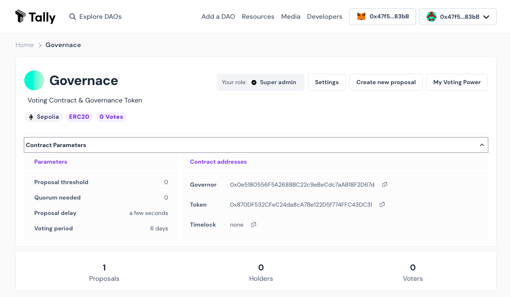

# Governance Token

A governance token is a type of cryptocurrency that allows holders to participate in the governance of a decentralized project. Holders can use their tokens to vote on proposals that affect the project, such as changes to the project's roadmap or the allocation of funds.

## Helpers Overview

After forking repo type ```npm i``` in your terminal.

Cross-check the package version if you stuck somewhere.

## .env Setup

```shell
touch .env
```

Paste the below code in the .env file and update it with your specific keys.

```
API_URL = "https://eth-sepolia.g.alchemy.com/v2/<ALCHEMY_API_KEY>"
PRIVATE_KEY = "<METAMASK_PRIVATE_KEY>"
ETHERSCAN_API_KEY = "<ETHERSCAN_API_KEY>"
```

## Smart Contract 

### Compile
```shell
npx hardhat compile
```

### Deploy

#### Token Contract
```shell
npx hardhat run scripts/deploytoken.js --network sepolia
```

#### Governor Contract
```shell
npx hardhat run scripts/deploygovernor.js --network sepolia
```

### Verify on Etherscan

#### Token Contract
```shell
npx hardhat verify --network sepolia <TOKEN_CONTRACT_ADDRESS>
```
#### Governor Contract 
```shell
npx hardhat verify --network sepolia <GOVERNOR_CONTRACT_ADDRESS> <TOKEN_CONTRACT_ADDRESS>
```

## Hardhar Helpers
Try running some of the following tasks:

```shell
npx hardhat help
npx hardhat test
REPORT_GAS=true npx hardhat test
npx hardhat node
npx hardhat run scripts/deploy.js
```

## Creating and executing proposals

A proposal is a sequence of actions the Governor contract will perform if it passes. Each action consists of a target address, call data encoding a function call, and an amount of ETH to include. Additionally, a proposal includes a human-readable description.

### Setup
1. Visit <link>tally.xyz</link> and click Add a DAO. Fill out your DAO's name, description, logo, website, ENS, etc. Click Submit to proceed.

2. Enter your DAO's contract address, which we got at the previous step. Tally will automatically fill out the remaining governance fields (type, network, starting block). Click Submit to proceed.

3. Tally will automatically fill out the token fields upon which our DAO is built. Click Submit to proceed.

4. That's it! Your DAO has been added to Tally. Your DAO page will require an additional 5–10 minutes to finish indexing.



## Contract Overview

### WebMobToken.sol

WebMobToken contract is an ERC20-compliant token with additional features for voting and permit functionality. It can be used in governance systems where token holders can vote on proposals and delegate their voting power to others. Additionally, token holders can approve transfers using EIP-712 permit signatures without submitting separate approval transactions.

##### Dependencies:

The contract imports three OpenZeppelin contracts that extend the functionality of the standard ERC20 token.

- ERC20.sol: This is the standard ERC20 token implementation, providing basic token functionality such as balanceOf, transfer, and allowance.

- draft-ERC20Permit.sol: This extension adds the permit function, which allows token holders to approve transfers using EIP-712 signatures without submitting separate approval transactions.

- ERC20Votes.sol: This extension enables voting with the tokens. It introduces functions for voting delegation and voting power tracking.

##### Constructor:
It calls the constructors of the parent contracts to set up the token parameters:

- ERC20("WebMobToken", "WMT"): Calls the constructor of ERC20 to set the token name to "WebMobToken" and the symbol to "WMT".

- ERC20Permit("WebMobToken"): Calls the constructor of ERC20Permit to set up the permit function using the domain separator name "WebMobToken".

##### Overrides:

The contract includes three internal functions that override the corresponding functions in the parent contracts:

- _afterTokenTransfer: 
This function is called after each token transfer, and it ensures that voting power is updated correctly after a transfer.

- _mint:
This function is called when new tokens are minted, and it ensures that voting power is updated accordingly.

- _burn: 
This function is called when tokens are burned, and it ensures that voting power is updated accordingly.

### WebMobGovernor.sol

WebMobGovernor contract is a customizable governance contract that can be used to manage proposals and voting for various decentralized governance systems. It allows users to create proposals, vote on proposals, and execute actions based on the voting results. Additionally, it incorporates features for vote counting, voting power tracking, and quorum calculation based on a fraction of the total voting power.

##### Dependencies:

The contract imports several OpenZeppelin contracts that extend the functionality of a governance system:

- Governor.sol: This is the base contract for a governor, providing core governance functionalities like creating proposals, voting, and executing actions.

- GovernorCountingSimple.sol: This extension adds simple vote counting logic, where proposals are accepted if they receive more "yes" votes than "no" votes.

- GovernorVotes.sol: This extension adds functionalities related to voting power tracking and delegation.

- GovernorVotesQuorumFraction.sol: This extension introduces a quorum calculation mechanism based on a fraction of the total voting power.

##### Constructor:

It takes an argument _token of type IVotes, which represents the voting token contract. The constructor initializes the Governor with the name "WebMobGovernor" and configures it with vote counting, voting power tracking, and quorum fraction functionalities.

##### Overrides:

- votingDelay Function:
This function is used to determine how long after a proposal is created, voting power should be fixed. In this case, it returns 1, which means voting power is fixed immediately after the proposal is created.

- votingPeriod Function:
This function is used to determine how long a proposal remains open for voting. In this case, it returns 45818, which corresponds to a voting period of 1 week in blocks (assuming a block time of ~13.14 seconds).

- proposalThreshold Function:
This function optionally sets a proposal threshold, which restricts proposal creation to accounts that have enough voting power. In this case, it returns 0, which means there is no minimum voting power required to create a proposal.

- quorum Function:
This function is an override required by Solidity. It calculates the quorum required for a proposal to be accepted based on a fraction of the total voting power. The calculation is implemented in the GovernorVotesQuorumFraction contract, and this function calls the super implementation to get the quorum value.
